# 📌 Project Description

- Text Reverser CI/CD Pipeline. This project is part of the #EverydayDevOps series, a hands-on journey to build a complete CI/CD pipeline step-by-step using real-world tools and concepts.
- The application itself is simple: a Java-based Text Reverser that takes in a line of text and outputs the reversed version. While the app logic is basic, the goal is not the complexity of the code, but to simulate a full pipeline like those used in production software delivery.

## This gives us the perfect playground to

- Build and test a Java app using Maven
- Automate tasks with Jenkins
- Scan code quality using SonarQube
- Store artifacts in Nexus Repository
- Enforce Quality Gates
- And eventually deploy via Tomcat

**Each tool is added day by day — building understanding, breaking blockers, and learning DevOps by doing.**

## Why This App?

- Lightweight, beginner-friendly
- Easy to test
- Perfect for exploring DevOps pipelines without overcomplicating the logic

## 📘 Day 1: Setup & Hello Java (Text Reverser App)

## 🧰 What You Need

- Ubuntu / WSL  
- Java 17  
- Maven  
- Internet connection 😄

---

## 🗂 Folder Structure

```bash
text-reverser/
├── scripts/
│   ├── setup_day1.sh          # Java & Maven install
│
├── src/
│   └── main/
│       └── java/
│           └── TextReverser.java  # Backend Java logic
│       └── webapp/
│           └── index.jsp         # Simple HTML frontend
├── pom.xml
└── README.md
```

---

## 🔧 Setup Steps

### 1. Create the project folder

- Open terminal on Pc and run the following commands to create project directory and move work to VS Code for easier working space

```bash
mkdir text-reverser && cd text-reverser
code .                                      #Move to VS Code
```

### 2. Create folders

- VS code terminal run below command to create App directories

```bash
mkdir -p scripts src/main/java/app
```

### 3. Add files

- Create below files justas seen in the file structure or clone repo
- Place `TextReverser.java` in `src/main/java/app/`
- Place `pom.xml` in the root
- Place `setup_day1.sh` inside `scripts/`
- Copy and Paste file contents in this Repo into your files.

### 4. Make setup script executable

- Make setup_day1 executable by runninig below command `setup_day1.sh is a bash file. this is to make automation of installations easier`

```bash
sudo chmod +x scripts/setup_day1.sh  #Make sure You're using an Ubuntu or WSL Shell to prevent issues in command line. Also you'll be promted to input your wsl password
```

### 5. Run setup

- After making it executable, the next step is to run it to make all neccessary installations in the file
- Run the below comand:

```bash
./scripts/setup_day1.sh        #OR
bash ./scripts/setup_day1.sh   # OR
cd scripts && bash setup_day1.sh
```

- Running App Output  

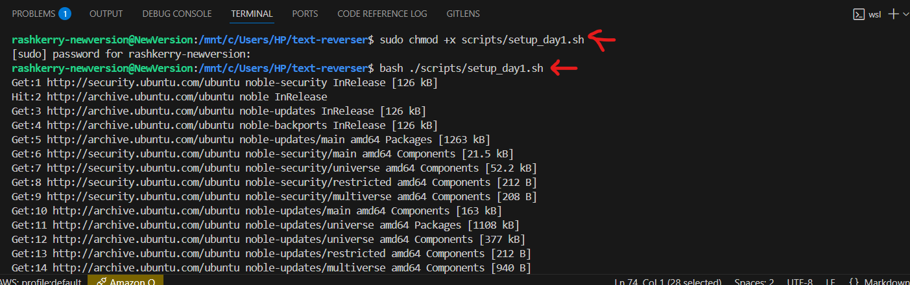

## 🛠️ Everyday DevOps - Day 2: Jenkins + Maven Integration

Welcome to **Day 2** of the Everyday DevOps series! Today, we're setting up Jenkins to build our Java-based **Text Reverser** app using **Maven**.

---

## 📁 Project Folder Structure

```bash
text-reverser/
├── scripts/
│   ├── setup_day1.sh          # Java & Maven install
│   └── setup_day2.sh          # Jenkins install
├── src/
│   └── main/
│       └── java/
│           └── TextReverser.java  # Backend Java logic
│       └── webapp/
│           └── index.jsp         # Simple HTML frontend
│           └── WEB-INF/
│               └── web.xml
├── pom.xml
└── README.md
```

## 🧱 Prerequisites

Make sure you have:

- Java (JDK 17 or higher)
- Maven
- Jenkins installed and running
- Internet connection 😄

---

### Jenkins and Java Installation(Using Bash Script for Automation)

- Create a new .sh file for java and jenkins inastallation automation.
- Copy and paste contents of setup_day2.sh in this repo and run below commands

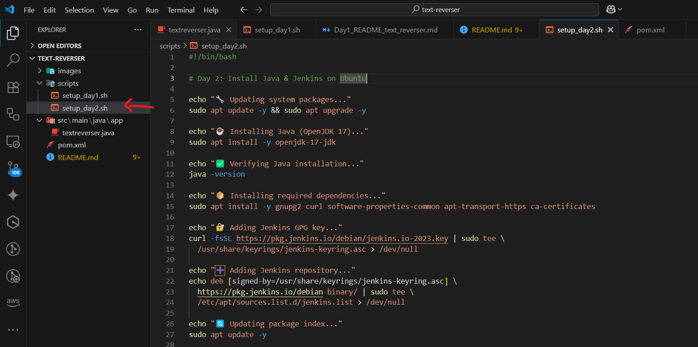

```bash
sudo chmod +x /scripts/setup_day2.sh   #Make file Executable
bash /scripts/setup_day2.sh            #Run file
```

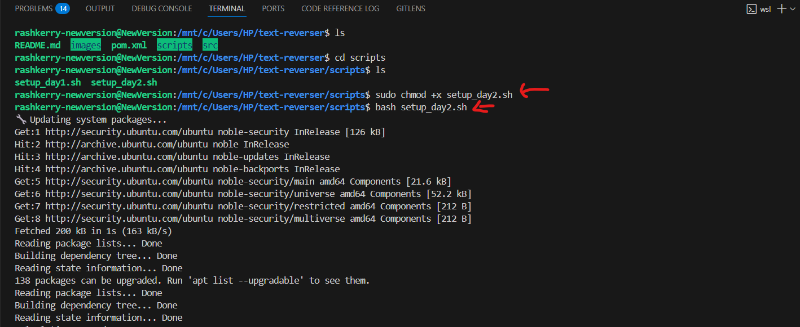

- After installation, run below commands:

```bash
sudo systemctl status jenkins    #To Check if Jenkins is Running. You should something like in the below image to confirm it's running.Make sure it says active
```

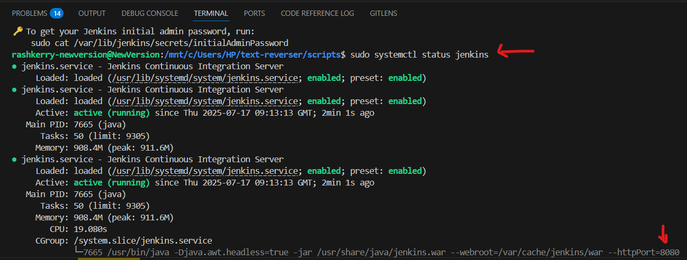

---

## 🧪 Step-by-Step Setup

### 1. ✅ Start Jenkins

- Jenkins runs on port 8080 by default. So open this in your browser:

```bash
http://localhost:8080
```

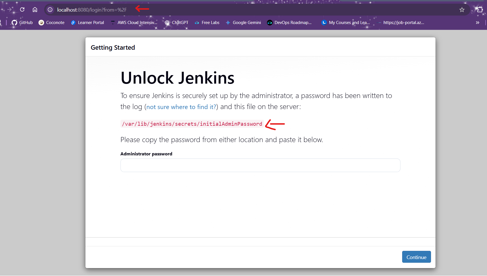

- Get the Jenkins Initial Admin Password
- Copy and paste into the Jenkins password column

```bash
sudo cat /var/lib/jenkins/secrets/initialAdminPassword
```

- Install Suggested Plugins
- Jenkins will ask:
    Install suggested plugins(Choose this for simplicity)
- Wait a few minutes ⏳ as Jenkins sets up.

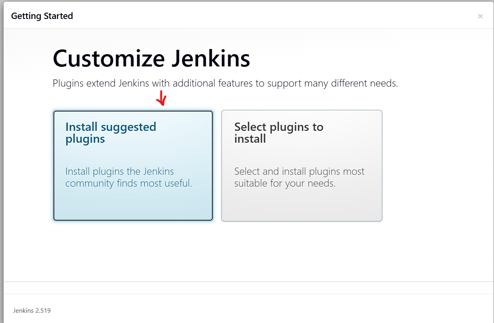

- Create Admin User
- Fill in your details (username, password, email)
- Save
- Or click “Continue as admin” if you want to skip account creation.

---

### 2. ➕ Create a Freestyle Project

- Click `New Item`
- Enter project name: `TextReverser Build`
- Select `Freestyle project`
- Click OK

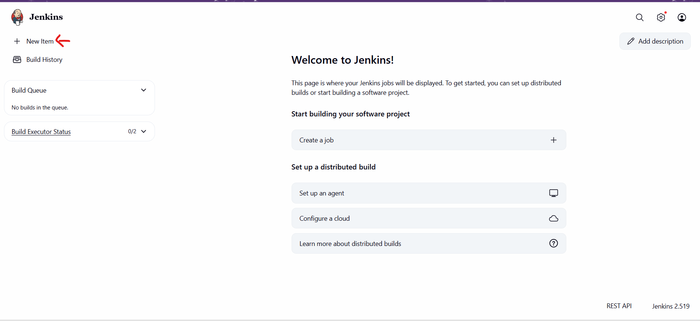
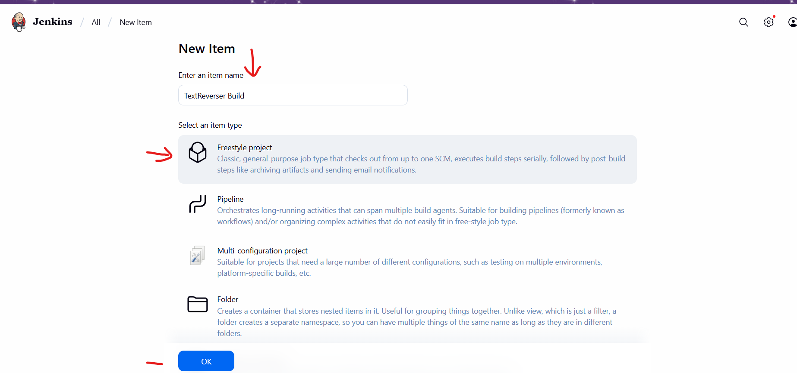

---

### 3. 🧬 Configure Git

- Create a Personal Access Token on GitHub
    Go to GitHub Profile → Settings → Developer Settings
    Click "Fine-grained tokens" or "Tokens (classic)"
    Generate a new token with: all access (check every box)
    Copy the token (you won’t see it again)

- Add the Token to Jenkins Credentials
    Open Jenkins → Dashboard
    Go to Manage Jenkins → Credentials
    Choose a domain (or use global)
    Click “Add Credentials”
      Select:
      Kind: Username with password
      Username: your GitHub username
      Password: the token you copied from GitHub
      Add a helpful ID like github-token
      Save

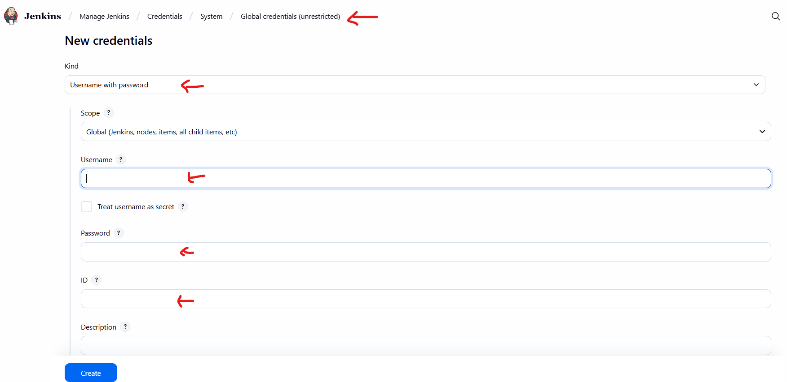

- Under `Source Code Management`, select **Git**
- Add your repo URL (create a GitHub repo if you haven’t already)
- Under Credentials, select the token you added (github-token)

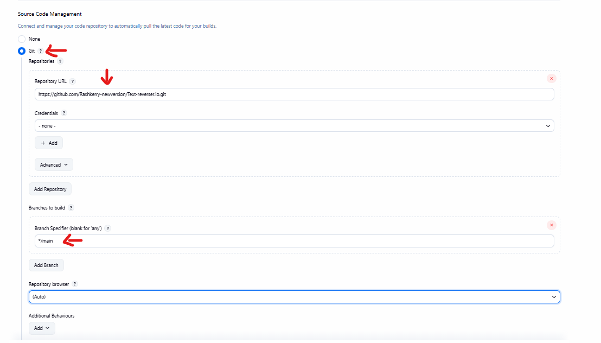

---

### 4. 🛠️ Add Build Step

- Scroll down
- Under `Build`, click `Add build step` → `Invoke top-level Maven targets`
- Goal: `clean package`

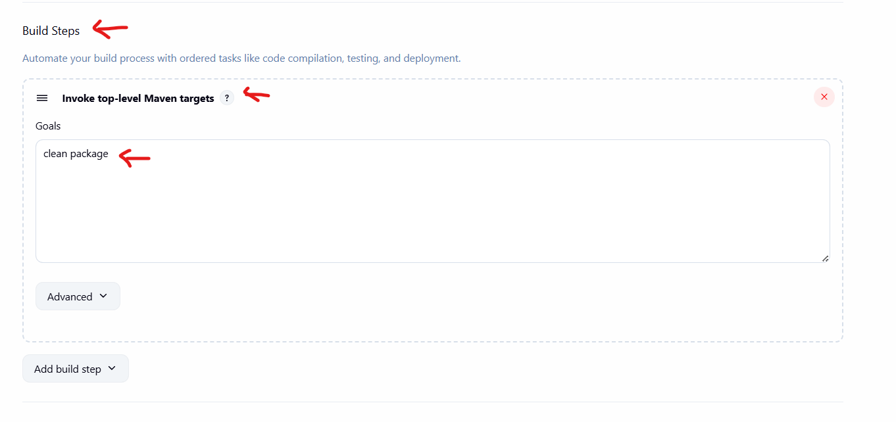

---

### 5. 🚀 Save and Build

- Click `Save`
- Hit `Build Now`

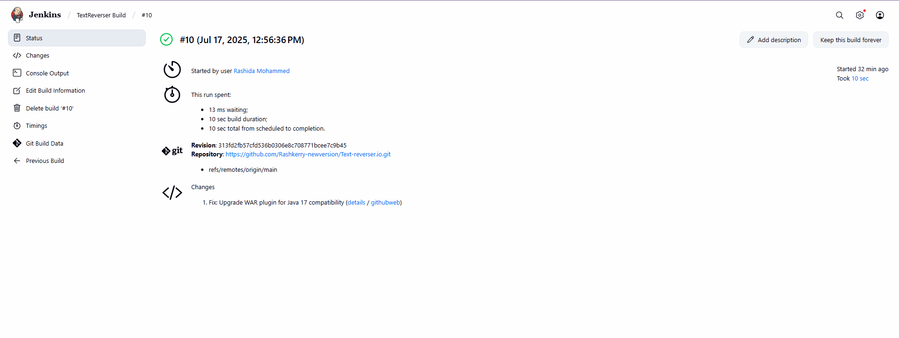

---

## 🧩 Troubleshooting

- ❌ Maven not found? Install it and make sure it's on PATH.
- ❌ Git repo error? Make sure your repo is public or add credentials.
- ❌ Jenkins not loading? Restart Jenkins or check port 8080.

---

## Day 2: Java WAR Deployment to Apache Tomcat Using Jenkins

Welcome to Day 7 of the Everyday DevOps series! Today we will:

- Install Apache Tomcat (Using Bash Automation).
- Deploy our Maven-built WAR file to Tomcat using Jenkins.
- Troubleshoot common issues during deployment.

**This guide walks you through installing Apache Tomcat 10.1.43 on your server (non-Docker), testing it, and integrating it with Jenkins to deploy a Java WAR file from your GitHub repo.**

## ✅ Prerequisites

Before you begin:

- Jenkins should already be installed and running.
- Your Java WAR project (like text-reverser) should be Maven-compatible.
- Your Jenkins job should pull code from GitHub.

---

## 📁 Project Structure

```bash
text-reverser/
├── scripts/
│   ├── setup_day1.sh
│   ├── setup_day2.sh
│   └── setup_day3.sh  <-- #Used for Tomcat Installation
├── src/
│   └── main/
│       ├── java/
│       │   └── app/
│       │       └── TextReverser.java
│       └── webapp/
│           ├── index.jsp
│           └── WEB-INF/
│               └── web.xml
├── pom.xml
└── README.md
```

---

## 🧰 Step 1: Run the Installer Script

- We want to make this easier with bash automation so we first create a .sh file in the script folder.
- Paste this script into a file called `setup_day3.sh` inside your `scripts/ folder`:
- This script installs Tomcat and verifies it's working.

```bash
#!bin/bash
# 1. Update System Packages
sudo apt update && sudo apt upgrade -y

# 2. Create tomcat user (skip if already exists)
sudo useradd -m -U -d /opt/tomcat -s /bin/false tomcat

# 3. Download Tomcat 10 (working version as of July 2025)
cd /tmp
wget https://archive.apache.org/dist/tomcat/tomcat-10/v10.1.24/bin/apache-tomcat-10.1.24.tar.gz

# 4. Extract and move to /opt
sudo mkdir -p /opt/tomcat
sudo tar -xzvf apache-tomcat-10.1.24.tar.gz -C /opt/tomcat --strip-components=1

# 5. Set Permissions
sudo chown -R tomcat: /opt/tomcat
sudo chmod +x /opt/tomcat/bin/*.sh

# 6. Start Tomcat
sudo /opt/tomcat/bin/startup.sh
```

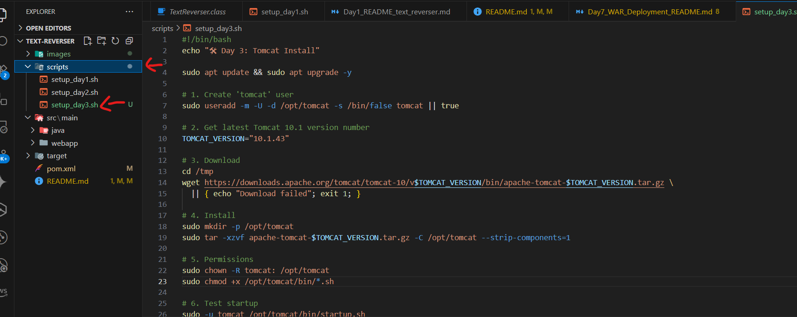

- Then run it:

```bash
cd scripts
bash setup_day3.sh
```

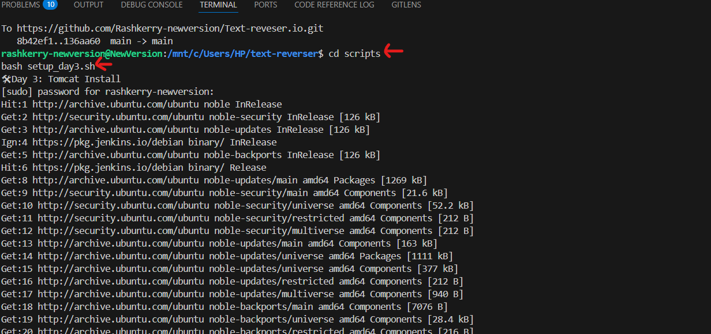

## 🛠 Step 2: Configure Tomcat for Jenkins Deployment

- Open the Tomcat users config file:

```bash
sudo nano /opt/tomcat/conf/tomcat-users.xml
```

- Add this block before the closing </tomcat-users> tag:

```bash
<role rolename="manager-script"/>
<user username="jenkins" password="jenkinspassword" roles="manager-script"/>
```

- Save & exit (`CTRL+O`, `Enter`, then `CTRL+X`)


- **Note:** Replace `"jenkinspassword"` with a secure password. Do not delete the outer `<tomcat-users>` block.

## 🔧 🌐 Step 3: Allow Tomcat Manager Access

- By default, Tomcat restricts access to the Manager App. To fix that run:

```bash
sudo nano /opt/tomcat/webapps/manager/META-INF/context.xml
```

- Comment out or remove this line: ``Add <!----> at begining and the end to comment it out`

```bash
<Valve className="org.apache.catalina.valves.RemoteAddrValve"
       allow="127\.\d+\.\d+\.\d+|::1" />
```

- Save & exit.

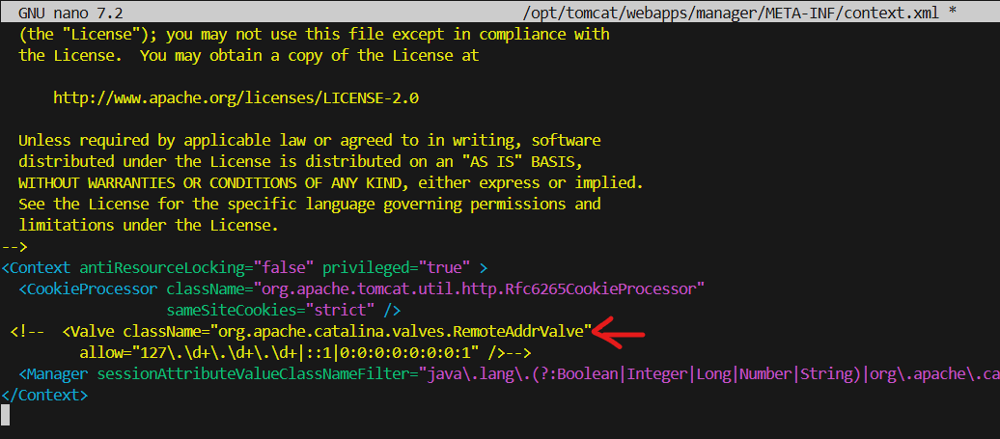

### Step-by-Step: Change Tomcat’s Port from 8080 to Another Port 8081

Since Jenkins is running on port 8080, there would be a conflit between Jenkins and Tomcat due to its default port also being port 8080. So the best thing to do is to change it's port number

- Make sure the new port you choose is not already in use on your system. Use sudo lsof -i :8081 to check.

- Open the Tomcat server configuration file:

```bash
sudo nano /opt/tomcat/conf/server.xml
```

-Look for the connector that listens on port 8080. It looks like this:

```bash
<Connector port="8080" protocol="HTTP/1.1"
           connectionTimeout="20000"
           redirectPort="8443" />
```

- Change the port from 8080 to something else, like 8081:

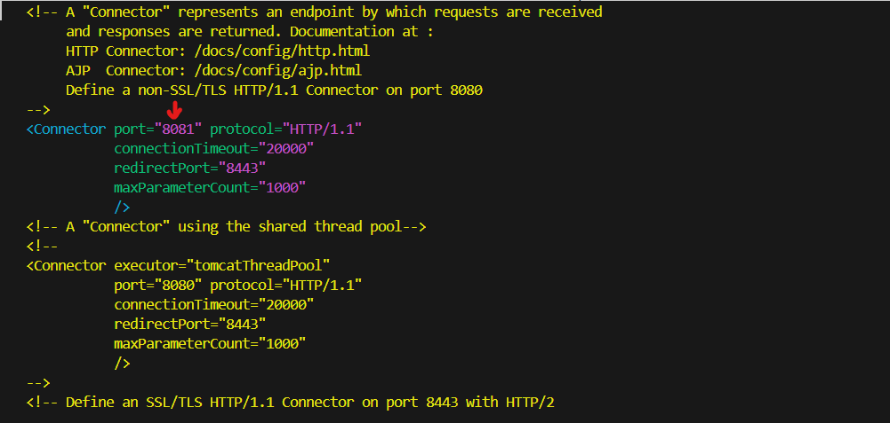

- Save and exit:
- Press CTRL+O → Enter to save
- Press CTRL+X to exit
- Restart Tomcat to apply the change:

```bash
sudo -u tomcat /opt/tomcat/bin/shutdown.sh
sleep 5
sudo -u tomcat /opt/tomcat/bin/startup.sh
```

- Test by opening your browser and visiting:

```bash
http://localhost:8081
```

- You should see the Tomcat homepage.

## 🔧 Step 4: Update Your Maven `pom.xml`

- Ensure `war`, Java version to 17, and looks like below script:

```xml
<?xml version="1.0" encoding="UTF-8"?>
<project xmlns="http://maven.apache.org/POM/4.0.0"
         xmlns:xsi="http://www.w3.org/2001/XMLSchema-instance"
         xsi:schemaLocation="http://maven.apache.org/POM/4.0.0 
                             http://maven.apache.org/xsd/maven-4.0.0.xsd">
    <modelVersion>4.0.0</modelVersion>

    <groupId>com.devops</groupId>
    <artifactId>text-reverser</artifactId>
    <version>1.0</version>
    <packaging>war</packaging>

    <name>Text Reverser</name>

    <build>
        <finalName>text-reverser</finalName>
        <plugins>
            <plugin>
                <groupId>org.apache.maven.plugins</groupId>
                <artifactId>maven-compiler-plugin</artifactId>
                <version>3.10.1</version>
                <configuration>
                    <source>17</source>
                    <target>17</target>
                </configuration>
            </plugin>
            <plugin>
                <groupId>org.apache.maven.plugins</groupId>
                <artifactId>maven-war-plugin</artifactId>
                <version>3.4.0</version>
            </plugin>
        </plugins>
    </build>
</project>
```

- Run `mvn clean package` to update `war` file.

## 🚀 Step 5: Configure Jenkins Job to Deploy WAR to Tomcat

**Note** make sure to install Deploy to container Plugin.

To do that:

- Go to Settings → Manage Jenkins → Plugins → Available Plugins
- Search and Install `Deploy to container Plugin`
- No need to restart Jenkins.

### Now Configure Post Build Actions

- Go to Jenkins → your freestyle job(TextReverser Buil) → Configure

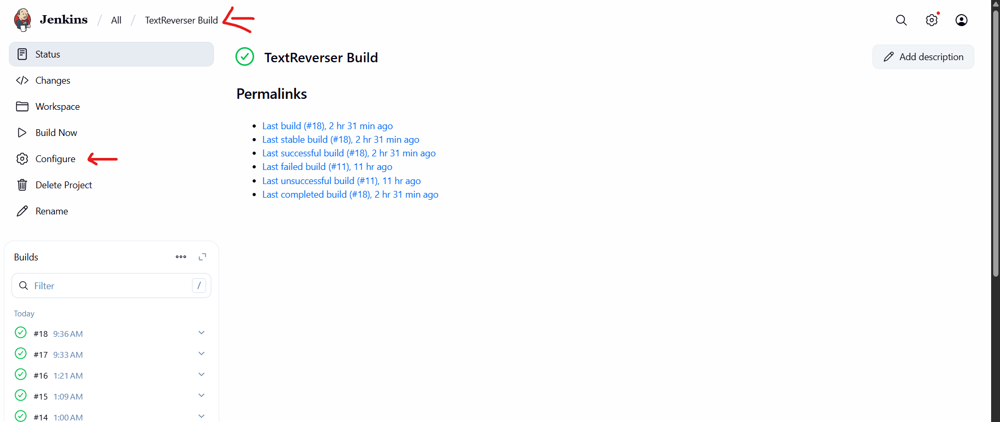

- Under Post-build Actions, click Add post-build action → select Deploy war/ear to a container

Fill in:

- WAR/EAR files: `**/target/*.war`
- Context path: `/text-reverser`
- Container: `Tomcat 9.x Remote`
- Tomcat URL: `<http://localhost:8081>`
- Credentials:
   click on add → Jenkins
   Kind : Username with password
   Enter below details
     Username: `jenkins` (tomcat username)
     Password: `jenkinspassword` (tomcat Password)
     then click add to finish
- Click Save to finish and build the job.

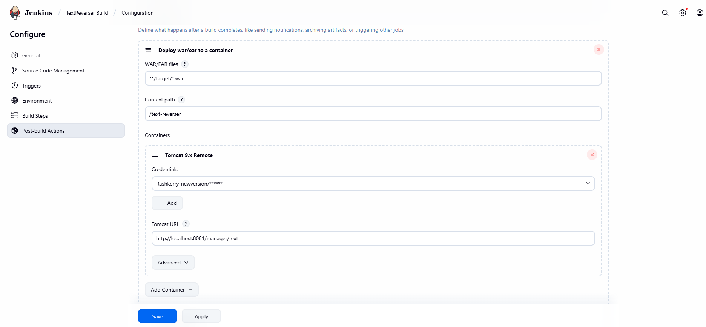

---

## ✅ Success Check

- Build ends with `BUILD SUCCESS`

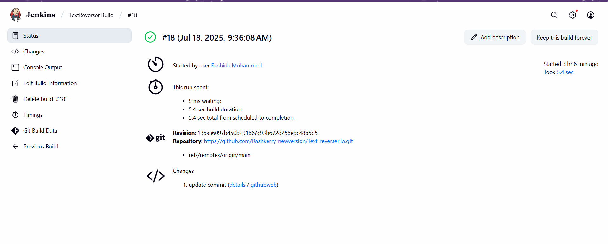

- WAR is deployed to Tomcat
- Navigate to: `http://localhost:8081/text-reverser/` and test form

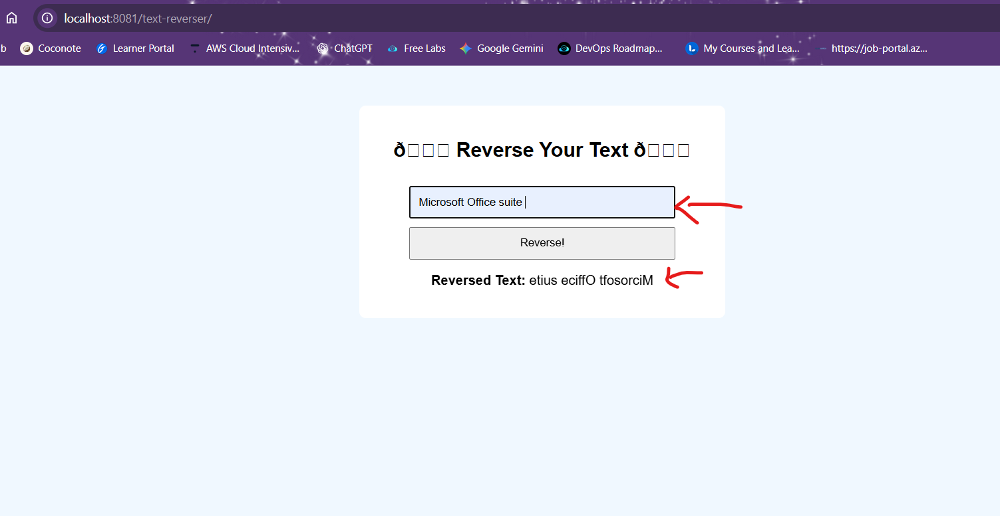

---

## 📌 Final Tip

Push all changes to GitHub before triggering Jenkins builds, as Jenkins pulls directly from your repo.

## 🐞 Common Errors & Fixes

| Error | Fix |
|------|------|
| **404 Downloading Tomcat** | Use archived versions (e.g. `10.1.24`) from [https://archive.apache.org/dist/tomcat/](https://archive.apache.org/dist/tomcat/) |
| **TextReverser cannot be resolved** | Make sure class is in `src/main/java/app/TextReverser.java` and JSP has `<%@ page import="app.TextReverser" %>` |
| **cargo.remote.username/password missing** | Set them in Jenkins deploy step OR use global credentials |
| **Cannot access /opt/tomcat/bin/startup.sh** | Make sure Tomcat was extracted correctly and has exec permissions |
| **JSP Compilation Error** | Check class path, rebuild WAR, and make sure Tomcat has access to compiled classes |

---

## 📘 Day 4: SonarQube Setup & Jenkins Integration

This guide walks you through installing **SonarQube** on your system and integrating it into your Jenkins pipeline to enable static code analysis for your Java WAR application.

---

## 🛠️ Step 1: Install SonarQube using Bash Script(setup_day4.sh)

- Create a new script for sonarqube setup.

> Script: `scripts/setup_day4.sh`

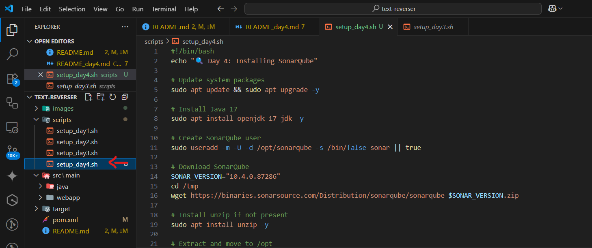

### 🔧 What the script does

- Installs Java 17 (if missing)
- Creates a system user for SonarQube
- Downloads and extracts SonarQube 10.4
- Starts SonarQube manually

- Run the script in your terminal:

```bash
bash scripts/setup_day4.sh
```

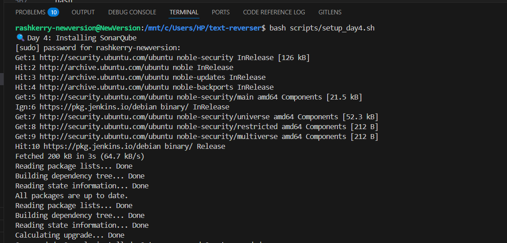

Once completed, visit [http://localhost:9000](http://localhost:9000) in your browser.

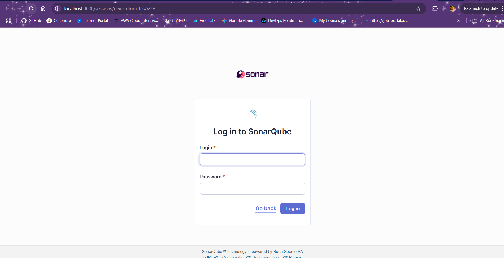

---

## 🔑 Step 2: Set Up SonarQube

1. Go to [http://localhost:9000](http://localhost:9000)
2. Login with:
   - **Username:** `admin`
   - **Password:** `admin`
3. Set a new password

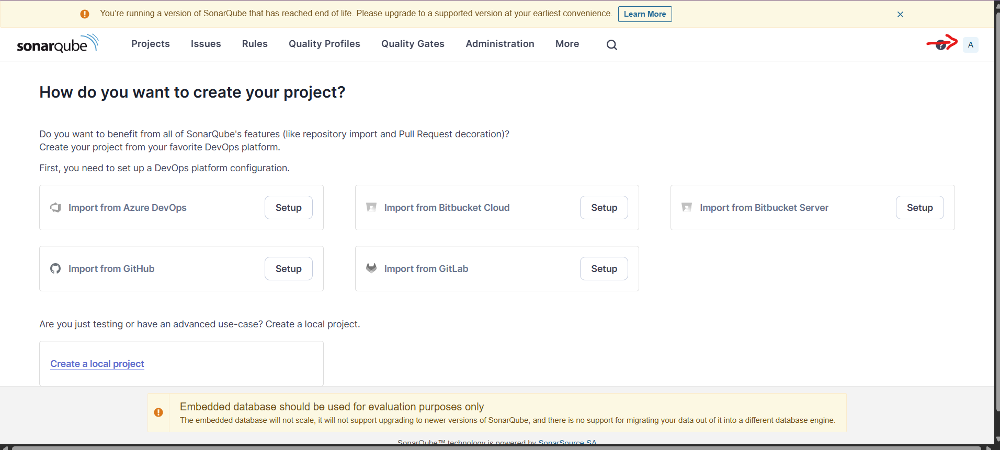
4. Go to **My Account > Security**
5. Generate a **token** (e.g., `jenkins-sonar-token`)
6. Token type **User token**
7. Copy the token for Jenkins use

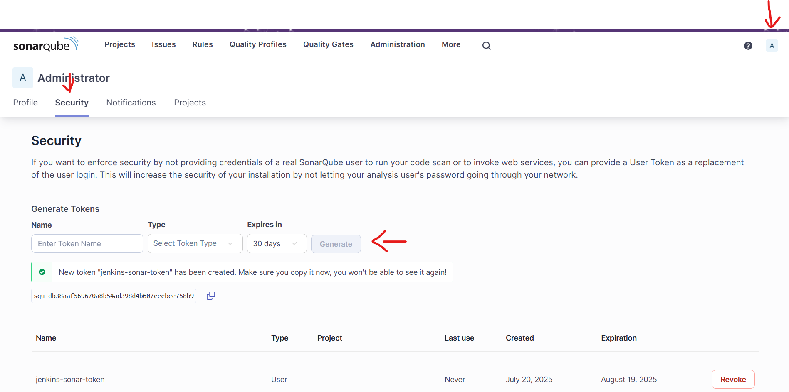

---

## 🔗 Step 3: Configure Jenkins for SonarQube

### 🔌 Step 1: Install "SonarQube Scanner for Jenkins" Plugin

- Go to Jenkins Dashboard
- Click "Manage Jenkins"
- Click "Plugins" (or "Manage Plugins")
- Go to the Available tab
- Search for:
    SonarQube Scanner for Jenkins
     Check the box and click Install without restart
- Wait for it to complete

### Step 2: Add the Token as a "Secret text" Credential in Jenkins

- This is where you need to make sure you select the correct "Kind".
- Go to your Jenkins Dashboard.
- Click Manage Jenkins.
- Click Manage Credentials (under "Security").
- In the "Stores scoped to Jenkins" section, click on Jenkins.
- Click on Global credentials (unrestricted).
- Click Add Credentials on the left sidebar.
    Crucially, for "Kind", select `Secret text`.
    **Scope**: Leave as Global.
    **Secret**: PASTE THE `SONARQUBE AUTHENTICATION TOKEN` YOU COPIED IN STEP 1 HERE.
    **ID**: Give it a meaningful ID (e.g., sonarqube-api-token). This is the name that will appear in the dropdown.
    **Description**: (Optional) Add a description like "SonarQube token for Jenkins integration".
- Click Create.

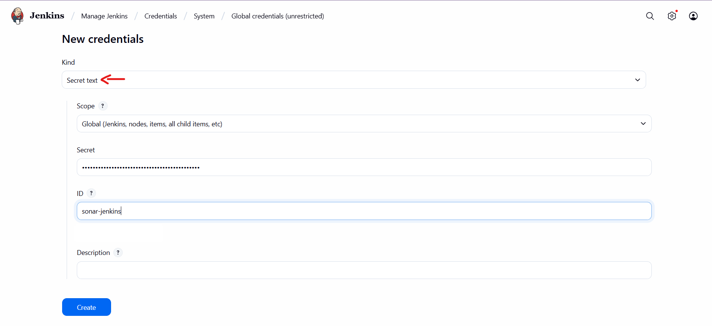

### ✅ Next Step: Add SonarQube Server

- 🔧 Go to:
    Manage Jenkins → System
    Scroll down until you see:
    “SonarQube Servers”
- In that section: Scroll down
    Click “Add SonarQube”
    **Set Name**: SonarQube
    **Set Server URL**: <http://localhost:9000>
    **Set Authentication Token**: Choose the one created from before
    Then click save

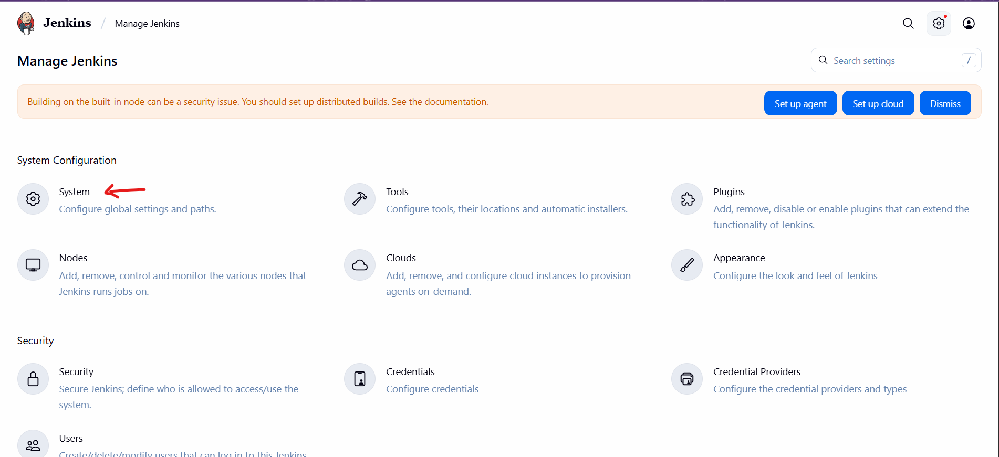
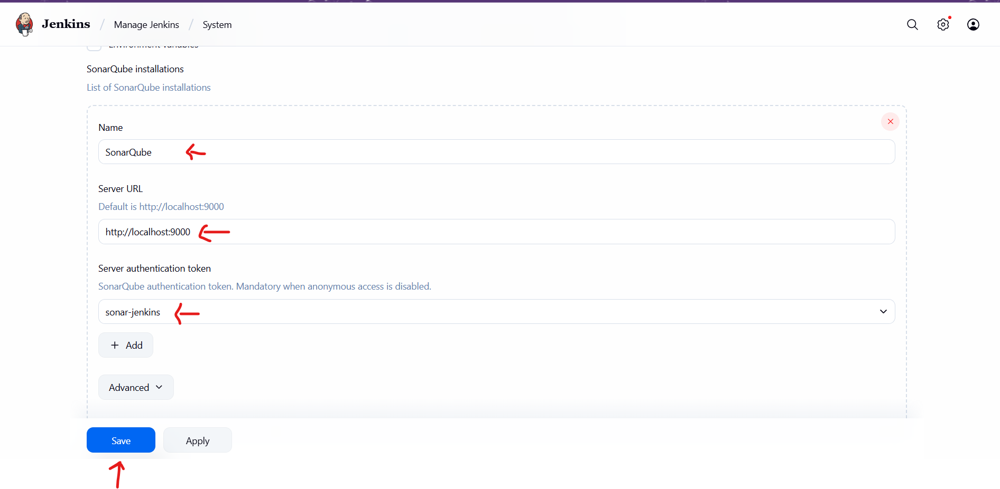
“SonarQube servers”

---

## Set up a Jenkins Job to Run a SonarQube Analysis

- You'll need a Jenkins job that checks out your code and then executes the SonarQube Scanner against it.

## 🔨 Step-by-Step: Add SonarQube Analysis to Freestyle Project

### Step 1: Open Your Jenkins Freestyle Project

- Go to your Jenkins dashboard
- Click your project (e.g. `TextReverser`)
- Click `Configure`

### Step 2: Add SonarQube Scanner to Build Step

Under Build, do the following:

- Click Add build step
- Choose `Execute SonarQube Scanner`

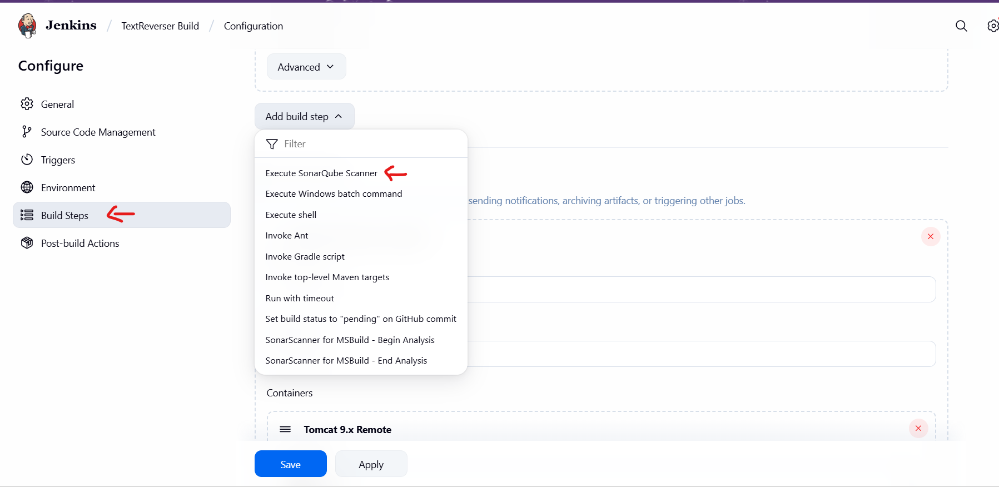

### Step 3: Configure the SonarQube Scanner Step

You’ll see a form with these fields:

- Task to run → Leave blank (uses default)
- Analysis Properties → Paste something like this:

```bash
sonar.projectKey=text-reverser
sonar.projectName=Text Reverser
sonar.projectVersion=1.0
sonar.sources=src
sonar.java.binaries=target/classes
sonar.language=java
```

📌 Make sure src and target/classes paths match your Java project structure.

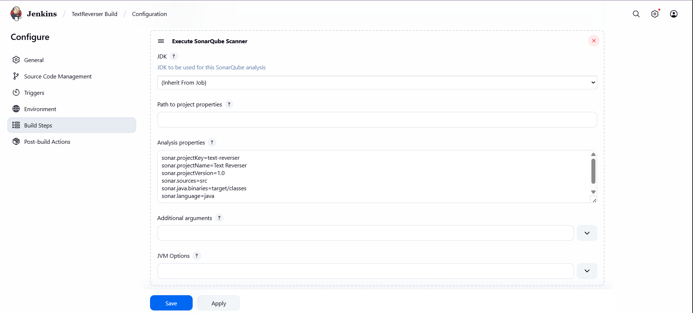

1. sonar.projectKey: A unique identifier for your project in SonarQube (e.g., com.mycompany.myproject). Keep it simple, no spaces.
2. sonar.projectName: The display name of your project in SonarQube.
3. sonar.projectVersion: The version of your project.
4. sonar.sources=.: Tells the scanner to analyze all source files in the current directory (where Jenkins checks out your code). Adjust this if your source code is in a subdirectory (e.g., sonar.sources=src/main/java).

(Leave other settings as default for now).

### Step 4: Save and Build

- Click Save
- Then click Build Now

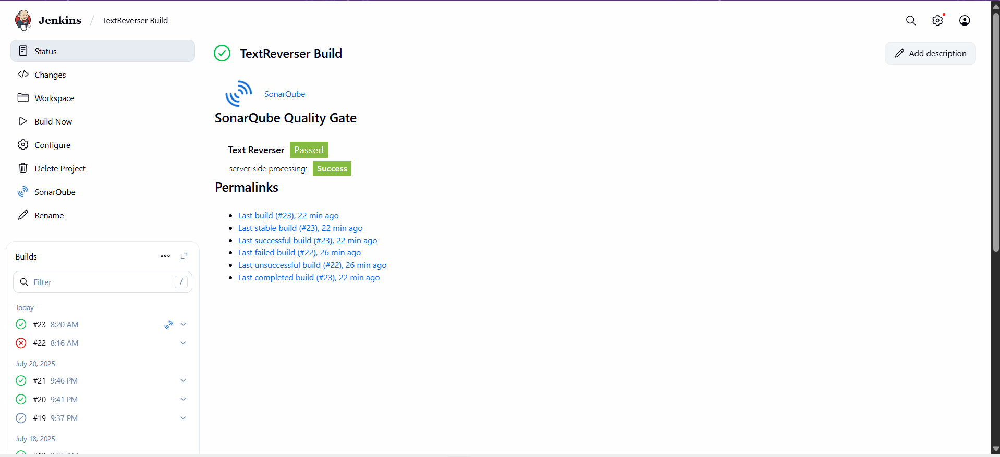
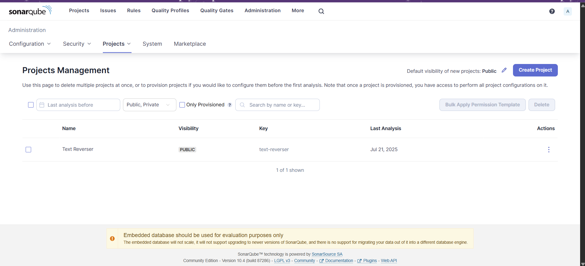
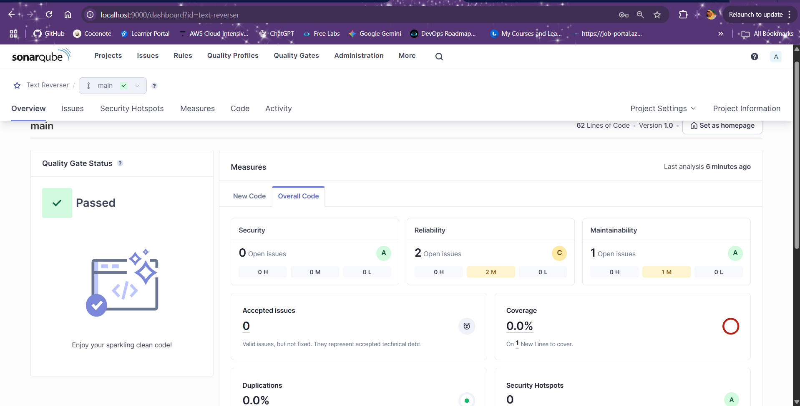


# 📦 Day 5: Nexus Repository Manager Setup & Jenkins Integration

Welcome to Day 5 of my Everyday DevOps journey! Today, we’re setting up **Sonatype Nexus Repository Manager** on a Linux system, and integrating it into Jenkins to publish our Java WAR builds.

---

## 🧰 What You’ll Achieve

- ✅ Install Nexus 3 (Community Edition) manually
- ✅ Set it up to auto-start using `systemd`
- ✅ Access Nexus through the browser
- ✅ Configure a Maven Hosted Repository
- ✅ Connect Jenkins to Nexus and deploy WAR files automatically

---

## 📜 Prerequisites

- Ubuntu/Debian server with sudo access  
- Jenkins already installed and working (see Day 1–3)
- Java 8+ installed

---

## 🖥️ Step 1: Bash Script – Nexus Installation (Non-Docker)

- Save this as `scripts/setup_day5.sh` in your project folder and run:

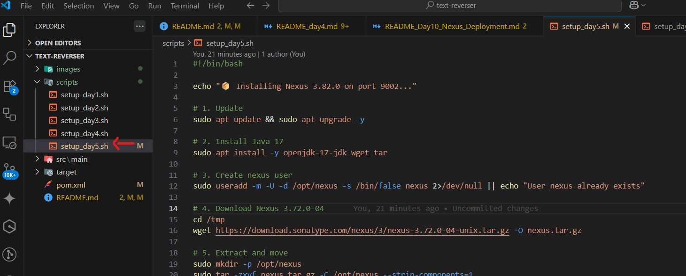

```bash
cd scripts
bash setup_day5.sh
```

- If you are having issues with nexus running. Run the following commands to troubleshoot:

```bash
sudo useradd -r -s /bin/false nexus     # Create a system user named 'nexus' without a home directory and no login shell

#  Change ownership of the Nexus installation directory
sudo chown -R nexus:nexus /opt/nexus          # Replace /opt/nexus with your actual Nexus installation path

#  Create the sonatype-work directory if it doesn't exist,
sudo mkdir -p /opt/sonatype-work
sudo chown -R nexus:nexus /opt/sonatype-work    # and set its ownership to the nexus user.

#  Set appropriate permissions for the sonatype-work directory
sudo chmod -R 755 /opt/sonatype-work    # The '755' allows the 'nexus' user to read/write/execute, and others to read/execute.

sudo systemctl daemon-reload   #reload systemd
sudo systemctl start nexus.service   #start nexus service

#Check the Status and Logs again
sudo systemctl status nexus.service
sudo journalctl -u nexus.service -n 50
```

- Connect to nexus via:

```bash
http://localhost:9002
```

- You should be directed to nexus home page

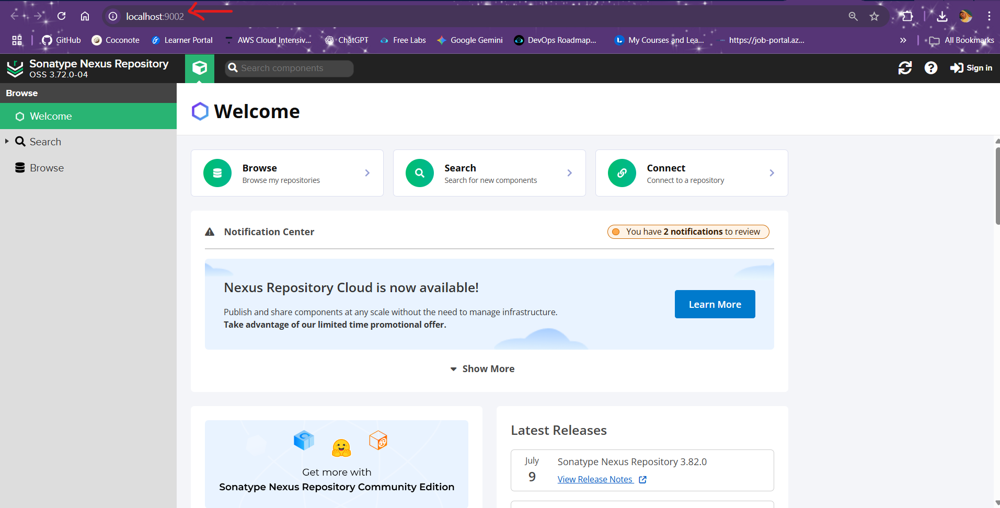

- Sign into nexus with:
    Username: admin
    password: Run `cat /opt/sonatype-work/nexus3/admin.password` in your terminal.
             copy and paste output as the password

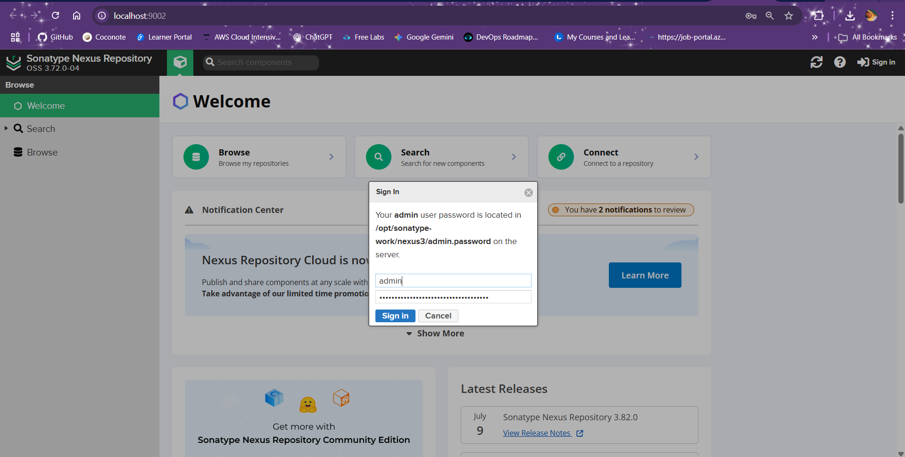

- You'll be prompted to create a new password

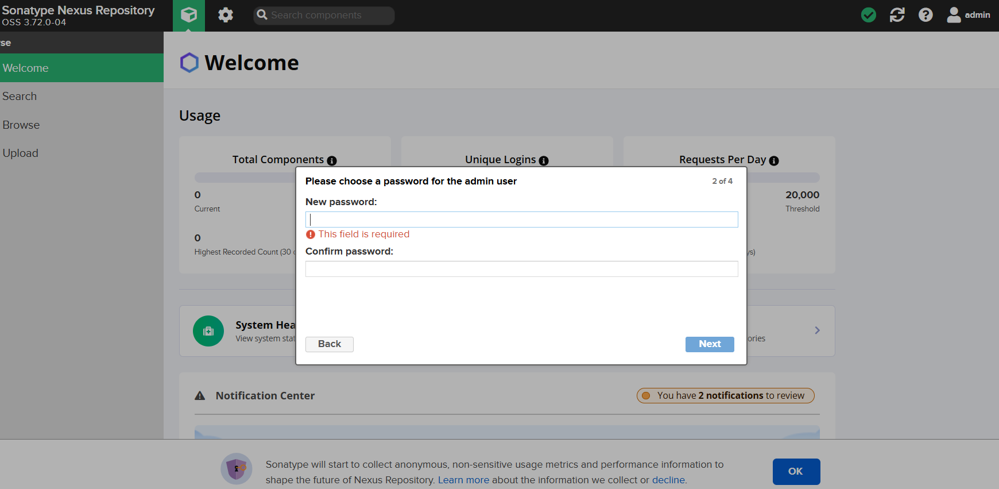

## 🧰Step 2: Create a New Maven Repository(Optional)

Go to:
“Repositories” > “Create repository” > choose maven2 (hosted)

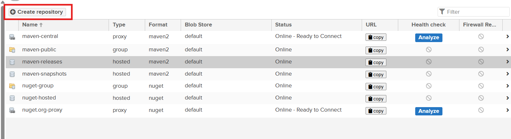

**Fill the form as:**

Field:

- Name: `maven-releases`

- Online: `Yes`

- Version policy: `Release`

- Write policy: `Allow redeploy` (for now)

- Deployment: `Enable via Nexus UI or REST`

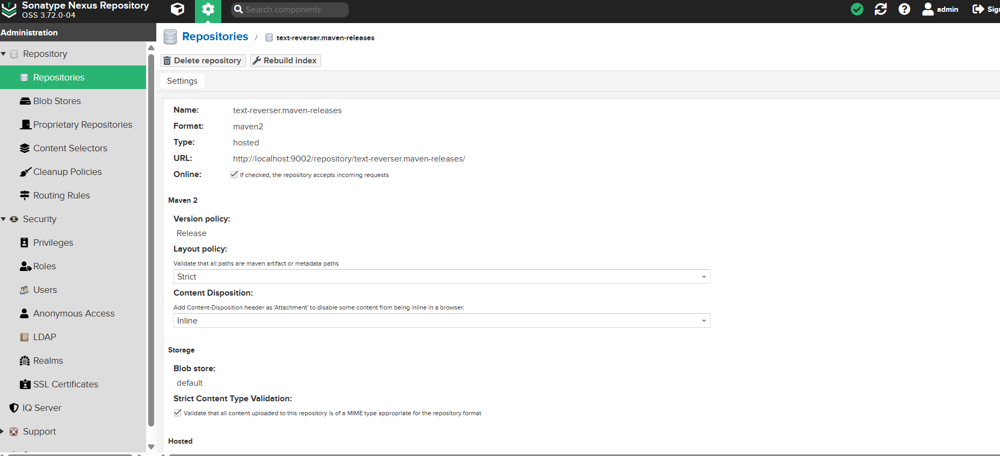

## 👤Step 3: Create a Deployment User (for Jenkins)

Create a New User for Jenkins`(on Nexus)`:

- In the Nexus UI, click the gear icon (Administration) in the top menu.

- In the left-hand navigation, go to Security > Users.

- Click the "Create user" button.

**Fill in the details:**

1. ID: jenkins-deployer (or similar descriptive name)

2. First Name: Jenkins

3. Last Name: Deployer

4. Email: (optional, can be a dummy email like jenkins@example.com)

5. Password: Choose a strong password and remember it. (e.g., jenkinsStrongPass123!)

6. Status: Active

7. Click "Create user".

**Assign Roles to the New User:**

- While still on the "Edit user" page for jenkins-deployer, scroll down to the "Roles" section.

- For a typical Maven deployment, you'll need roles that allow pushing artifacts to hosted repositories.

**Add these roles:**

- nx-anonymous (Allows basic read access, generally a good baseline)

- nx-developer (Provides privileges for creating and updating components/artifacts)

`Alternatively (for simplicity in a development/challenge environment): You can assign nx-admin. This gives full administrative access, but is less secure for production. For this challenge, nx-admin is often easiest if nx-developer proves insufficient for some reason.`

- Click "Add role" for each.

- Click "Save" at the bottom of the user configuration.

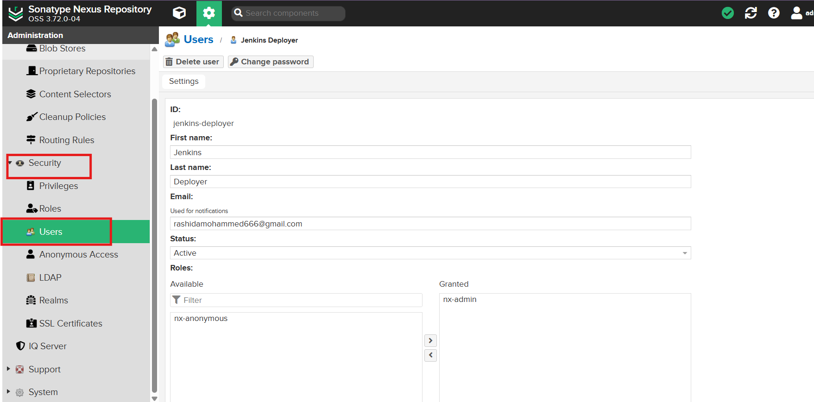

## 🔗Step 4: Get Nexus Repository URL

- It will look like:

```bash
http://<your-server>:9002/repository/maven-releases/
```

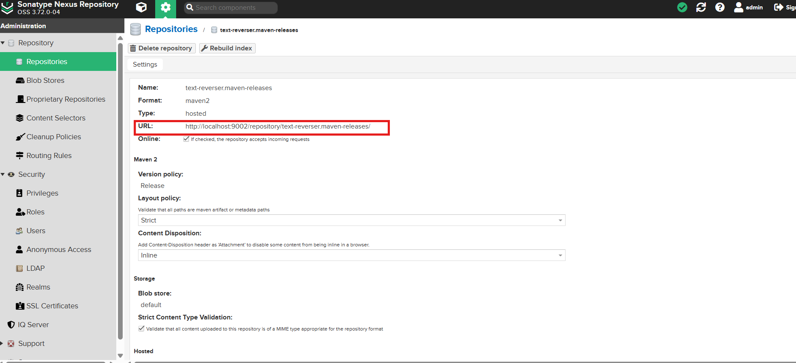

Copy this, you'll use it in your Jenkins pom.xml and/or Maven settings.

## 🛠️Step 5: Configure Maven Credentials in Jenkins

- Go to Jenkins → Manage Jenkins > Credentials > Global > Add Credentials

1. Kind: Username with password

2. Username: jenkins (or whatever you created)

3. Password: Your password

4. ID: nexus-credentials

5. Description: Nexus deploy user

## 📦Step 6: Update Your pom.xml

- Add the distributionManagement section:

```bash
<distributionManagement>
  <repository>
    <id>nexus</id>
    <url>http://localhost:9002/repository/maven-releases/</url>  # Replace with your Nexus repository URL
  </repository>
</distributionManagement>
```

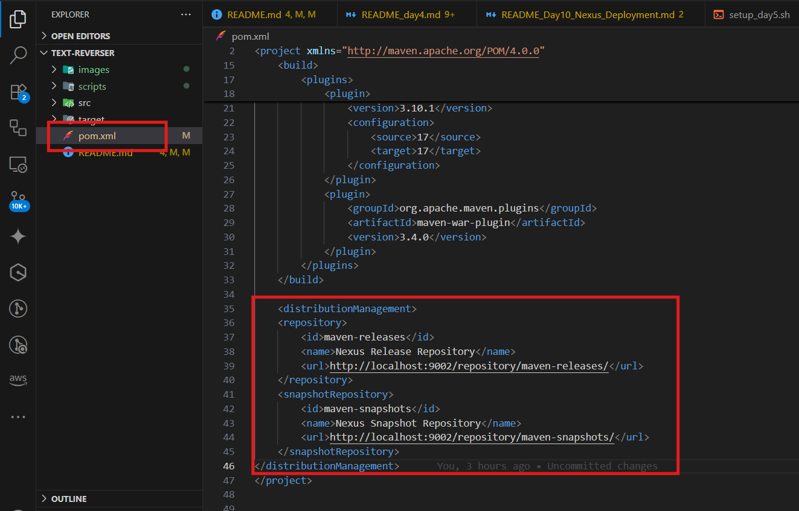

## ✅ Step 7: Enable Maven Build in Jenkins

### 🔧 Step 1: Install Maven Integration Plugin

- Go to Jenkins Dashboard → Manage Jenkins

- Click on “Manage Plugins”

- Go to the Available tab

- Search for: `Maven Integration`

- Check the box next to it

- Click `Install` (without restart)

### 🏗 Step 2: Configure Maven in Jenkins

- Go to Manage Jenkins → Global → Tool Configuration

- Scroll to Maven section

- Click Add Maven

    1. Name: Maven3 (or any name you’ll reference later)

    2. Check Install automatically

    3. Choose version e.g. 3.9.6 or any available stable

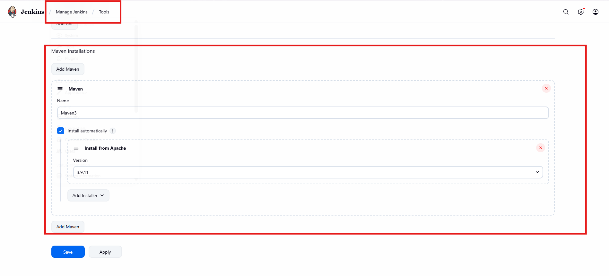

## ⚙️Step 8: Update Jenkins Job for Maven Deploy

-In Jenkins, go to your freestyle project

- Add build step:

`Invoke top-level Maven targets`

Goals:

```bash
clean deploy
```

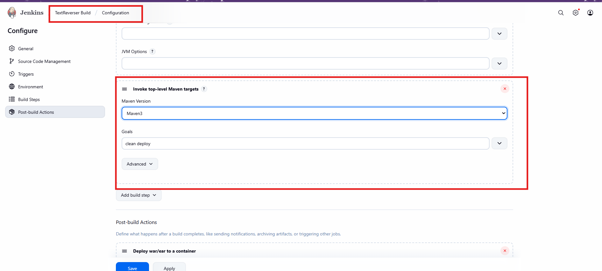

- Advanced > Settings
- Choose Maven installation and add below to properties tab:

```bash
-Dmaven.test.skip=true
```

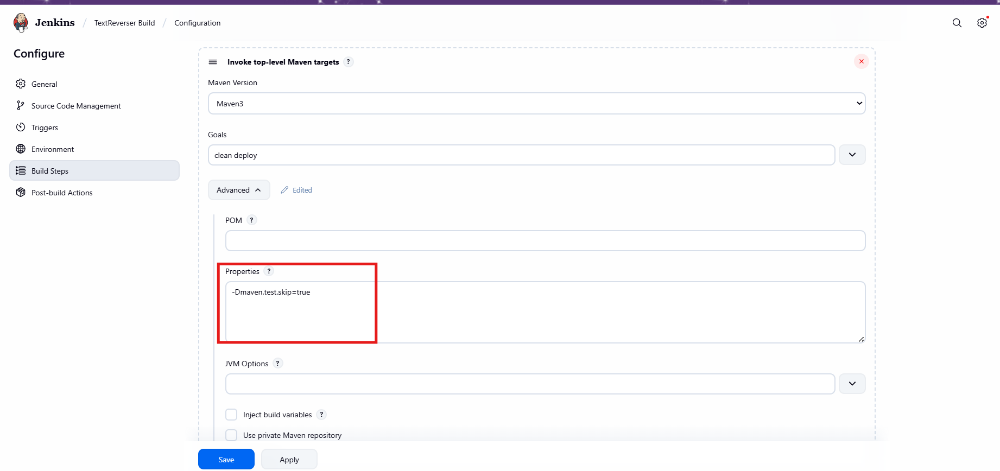

- Save

### Step 9: Place settings.xml manually in Jenkins' Maven home

### 🔧 Step-by-Step

- Create a directory for Maven settings (if it doesn’t exist):

```bash
sudo mkdir -p /var/lib/jenkins/.m2
```

- Create or edit the settings.xml file:

```bash
sudo nano /var/lib/jenkins/.m2/settings.xml
```

- Paste the following content (update with your actual Nexus credentials):

```bash
<settings xmlns="http://maven.apache.org/SETTINGS/1.0.0"
          xmlns:xsi="http://www.w3.org/2001/XMLSchema-instance"
          xsi:schemaLocation="http://maven.apache.org/SETTINGS/1.0.0
                              https://maven.apache.org/xsd/settings-1.0.0.xsd">
  <servers>
    <server>
      <id>maven-releases</id>
      <username>your-nexus-username</username>
      <password>your-nexus-password</password>
    </server>
  </servers>
</settings>
```

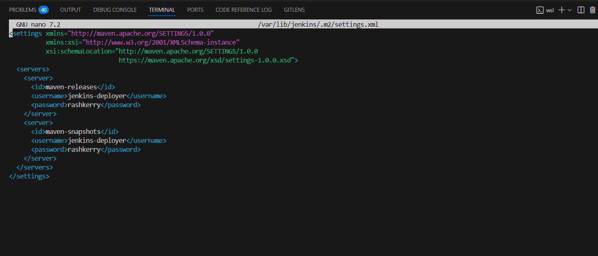

- Make sure Jenkins has read permissions:(make sure to use jenkins user you created)

```bash
sudo chown -R jenkins:jenkins /var/lib/jenkins/.m2
```

- Restart Jenkins to be safe:

```bash
sudo systemctl restart jenkins
```

- Go back to Jenkins GUI, then Build project

### Check the Jenkins Console Output

- After your Jenkins build finishes, always check the console output for the Maven deploy goal.

- Go to your Jenkins Dashboard.

- Click on your TextReverser Build job.

- Click on the latest build number (e.g., #15).

- Click "Console Output" on the left sidebar.

- Scroll through the logs and look for the section where Maven's deploy plugin runs.

**What to look for:**

`[INFO] BUILD SUCCESS.`

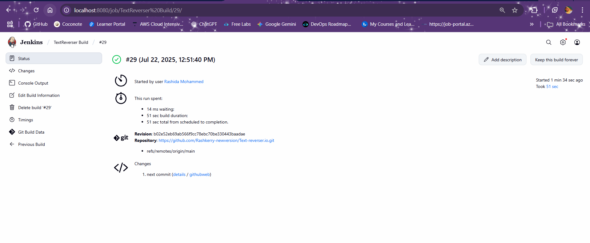

### Browse Nexus Repository Manager UI

- This is the most reliable way to visually confirm your artifact is there.

- Navigate to your Nexus Repository Manager instance: `<http://localhost:9002>`.

- Log in with your Nexus admin credentials.

- In the left-hand navigation pane, click on `"Browse"` under `"Repositories"`.

- You will see a list of your repositories.

- Click on maven-releases. AND/OR Click on maven-snapshots if your pom.xml's version ends with -SNAPSHOT (e.g., 1.0-SNAPSHOT). `i.e. if it was added in the pom.xml file.

- Navigate through the folder structure that matches your groupId and artifactId:

    1. You should see: `com/`

    2. Then: `com/devops/`

    3. Then `com/devops/text-reverser/`

    4. Inside `text-reverser/`, you should see a folder for your `project's version` (e.g., 1.0/ or 1.0-SNAPSHOT/).

    5. Click into the version folder. You should see your text-reverser-1.0.war file (and its .pom file, .md5, .sha1 checksums) listed there.

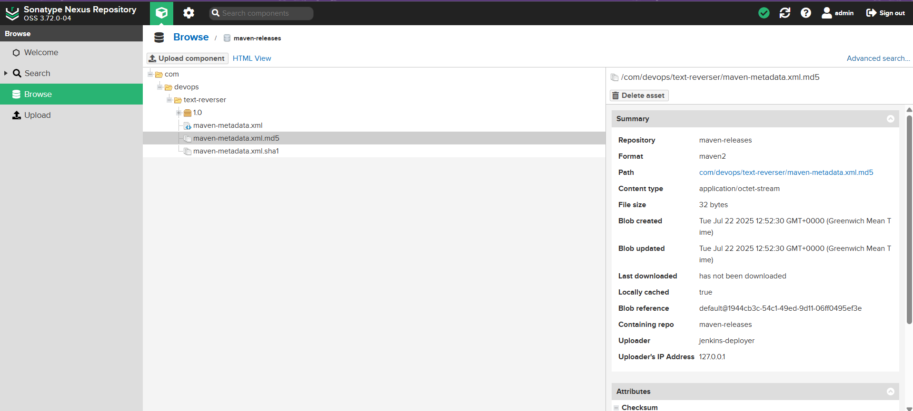

## Note

**By default, Nexus "Release" repositories are configured to be immutable. This means once an artifact (like text-reverser-1.0.war) is deployed to a release repository, you cannot overwrite it. This is a best practice to ensure the integrity and traceability of your released software versions.**

- This means that your build would fail over and over again until the version of your code is updated.

### How to Fix It:

- You have two main options, depending on your goal:

**`Option 1 (Recommended for Releases): Change Your Project Version in pom.xml`**

- This is the standard practice for releases. Each time you deploy a new "release" version, you should increment the version number.

1. Open your pom.xml file.

2. Find the `version` tag in your pom.xml:

    ```bash
    <version>1.0</version>
    ```

    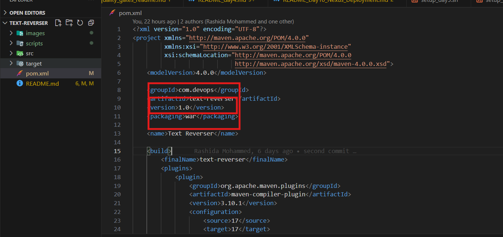

3. Change it to a new, unique version number. For example:

    ```bash
    <version>1.1</version>
    ```

4. Or, if you're making a minor fix to the existing 1.0 release:

    ```bash
    <version>1.0.1</version>
    ```

    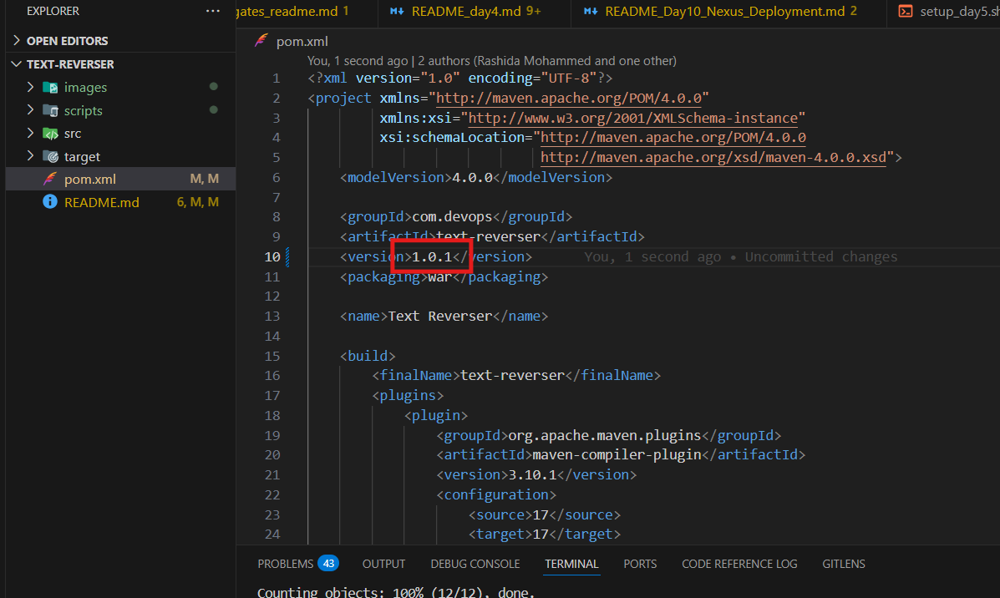

5. Save your pom.xml.

6. Commit and push this change to your GitHub repository.

7. Trigger a new build in Jenkins.

8. This is the proper way to handle releases. Each deployment to maven-releases should have a unique version.

---

## Day 6: ✅ SonarQube Quality Gates Integration (Jenkins + Existing Token)

This guide walks you through the process of integrating **SonarQube Quality Gates** with Jenkins for your CI/CD pipeline.

---

### 🔧 Prerequisites

- Jenkins is installed and running
- SonarQube is installed and accessible at: `http://localhost:9000`
- You already:
  - Installed the **SonarQube Scanner plugin** in Jenkins
  - Added **SonarQube server** in Jenkins settings
  - Configured the **SonarQube token** under Jenkins credentials
  - Installed the **"Sonar Quality Gates Plugin"** in Jenkins

---

## 🧩 Step-by-Step Integration

### 📦 Step 1: Install Quality Gates Plugin

1. Go to Jenkins dashboard → `Manage Jenkins` → `Manage Plugins`

2. Under the **Available** tab, search for:

   `Sonar Quality Gates Plugin`

3. Install it and **restart Jenkins** if prompted.

---

### 🔐 Step 2: Verify SonarQube Server & Token

1. Go to `Manage Jenkins` → `Configure System`

2. Scroll to **SonarQube Servers**

   - Verify:

     - Server URL: `http://localhost:9000`

     - Credentials: Your existing token (added under **Add → Secret text**)

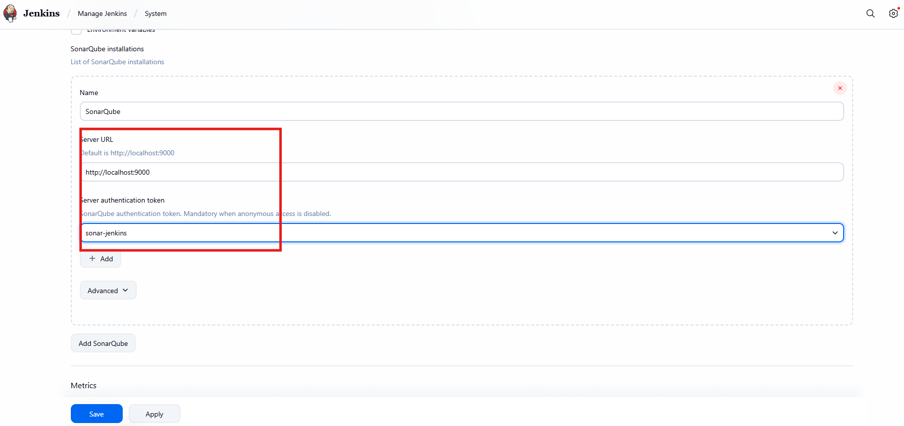

---

### 🛠️ Step 3: Configure Jenkins Job

1. Open your Jenkins **Freestyle Project**

2. Go to `Configure` → Scroll to **Post-build Actions**

3. Click `Add post-build action` → Choose:  `Sonar Quality Gates`

   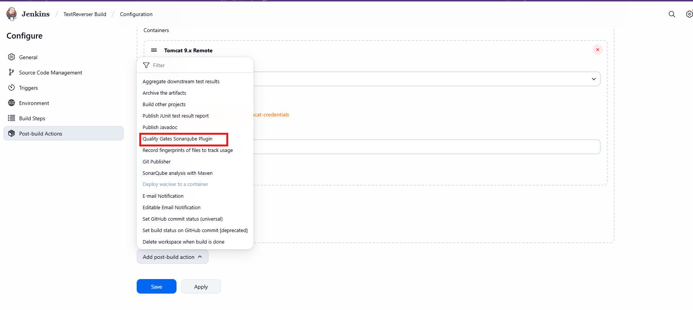

4. Choose:

    **SonarQube Installation**: Should auto-select if you configured earlier

    **Project Key**: Your project key from SonarQube (same as in your `pom.xml`)

    **Wait for Quality Gate**: ✅ Check this to enforce pass/fail condition

---

## ✅ Final Setup Checklist

| Item                                 | Status        |
|--------------------------------------|---------------|
| SonarQube running on `localhost:9000`| ✅             |
| Jenkins server running               | ✅             |
| Sonar Scanner installed in Jenkins   | ✅             |
| SonarQube token added in Jenkins     | ✅             |
| Quality Gates plugin installed       | ✅             |
| Post-build action added              | ✅             |

---

## 💡 Result

Once everything is configured:

- Your Jenkins build will **pause and wait** for SonarQube's Quality Gate result.
- If it **fails**, the build will be marked as **FAILED**.
- If it **passes**, the build will continue.

---

## 📸 (Optional) Markdown Image References

Include these if you're building a README with images:

```markdown


```

---

## 🤔 Common Issues

| Problem                          | Fix                                                                 |
|----------------------------------|----------------------------------------------------------------------|
| SonarQube project key mismatch   | Make sure your `pom.xml` and SonarQube dashboard use same key       |
| Quality Gate not triggering      | Ensure Jenkins build actually **runs SonarQube scan** during build  |
| Token invalid                    | Double-check you selected the **correct existing secret token**     |

---

## 📍 References

- [SonarQube Docs](https://docs.sonarsource.com/)
- [Quality Gates Plugin](https://plugins.jenkins.io/quality-gates/)

📝 _This project is part of the #EverydayDevOps series._
Happy automating! 🚀
