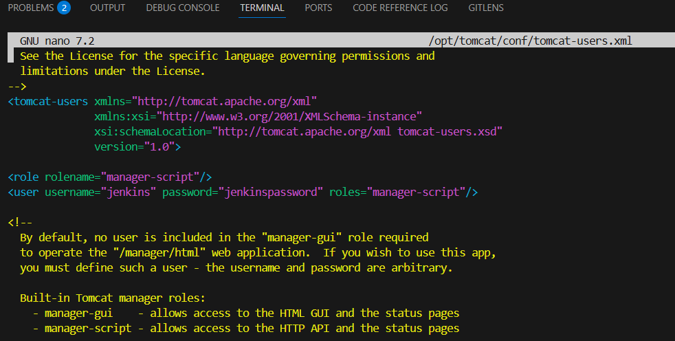

# 📌 Project Description

- Text Reverser CI/CD Pipeline. This project is part of the #EverydayDevOps series, a hands-on journey to build a complete CI/CD pipeline step-by-step using real-world tools and concepts.
- The application itself is simple: a Java-based Text Reverser that takes in a line of text and outputs the reversed version. While the app logic is basic, the goal is not the complexity of the code, but to simulate a full pipeline like those used in production software delivery.

## This gives us the perfect playground to:

- Build and test a Java app using Maven
- Automate tasks with Jenkins
- Scan code quality using SonarQube
- Store artifacts in Nexus Repository
- Enforce Quality Gates
- And eventually deploy via Tomcat

**Each tool is added day by day — building understanding, breaking blockers, and learning DevOps by doing.**

## Why This App?

- Lightweight, beginner-friendly
- Easy to test
- Perfect for exploring DevOps pipelines without overcomplicating the logic

## 📘 Day 1: Setup & Hello Java (Text Reverser App)

## 🧰 What You Need

- Ubuntu / WSL  
- Java 17  
- Maven  
- Internet connection 😄

---

## 🗂 Folder Structure

```bash
text-reverser/
├── scripts/
│   ├── setup_day1.sh          # Java & Maven install
│
├── src/
│   └── main/
│       └── java/
│           └── TextReverser.java  # Backend Java logic
│       └── webapp/
│           └── index.jsp         # Simple HTML frontend
├── pom.xml
└── README.md
```

---

## 🔧 Setup Steps

### 1. Create the project folder

- Open terminal on Pc and run the following commands to create project directory and move work to VS Code for easier working space

```bash
mkdir text-reverser && cd text-reverser
code .                                      #Move to VS Code
```

### 2. Create folders

- VS code terminal run below command to create App directories

```bash
mkdir -p scripts src/main/java/app
```

### 3. Add files

- Create below files justas seen in the file structure or clone repo
- Place `TextReverser.java` in `src/main/java/app/`
- Place `pom.xml` in the root
- Place `setup_day1.sh` inside `scripts/`
- Copy and Paste file contents in this Repo into your files.


### 4. Make setup script executable

- Make setup_day1 executable by runninig below command `setup_day1.sh is a bash file. this is to make automation of installations easier`

```bash
sudo chmod +x scripts/setup_day1.sh  #Make sure You're using an Ubuntu or WSL Shell to prevent issues in command line. Also you'll be promted to input your wsl password
```

### 5. Run setup

- After making it executable, the next step is to run it to make all neccessary installations in the file
- Run the below comand:

```bash
./scripts/setup_day1.sh        #OR
bash ./scripts/setup_day1.sh   # OR
cd scripts && bash setup_day1.sh
```

- Running App Output  


## 🛠️ Everyday DevOps - Day 2: Jenkins + Maven Integration

Welcome to **Day 2** of the Everyday DevOps series! Today, we're setting up Jenkins to build our Java-based **Text Reverser** app using **Maven**.

---

## 📁 Project Folder Structure

```bash
text-reverser/
├── scripts/
│   ├── setup_day1.sh          # Java & Maven install
│   └── setup_day2.sh          # Jenkins install
├── src/
│   └── main/
│       └── java/
│           └── TextReverser.java  # Backend Java logic
│       └── webapp/
│           └── index.jsp         # Simple HTML frontend
│           └── WEB-INF/
│               └── web.xml
├── pom.xml
└── README.md
```

## 🧱 Prerequisites

Make sure you have:

- Java (JDK 17 or higher)
- Maven
- Jenkins installed and running
- Internet connection 😄

---

### Jenkins and Java Installation(Using Bash Script for Automation)

- Create a new .sh file for java and jenkins inastallation automation.
- Copy and paste contents of setup_day2.sh in this repo and run below commands


```bash
sudo chmod +x /scripts/setup_day2.sh   #Make file Executable
bash /scripts/setup_day2.sh            #Run file
```


- After installation, run below commands:

```bash
sudo systemctl status jenkins    #To Check if Jenkins is Running. You should something like in the below image to confirm it's running.Make sure it says active
```


---

## 🧪 Step-by-Step Setup

### 1. ✅ Start Jenkins

- Jenkins runs on port 8080 by default. So open this in your browser:

```bash
http://localhost:8080
```


- Get the Jenkins Initial Admin Password
- Copy and paste into the Jenkins password column

```bash
sudo cat /var/lib/jenkins/secrets/initialAdminPassword
```

- Install Suggested Plugins
- Jenkins will ask:
    Install suggested plugins(Choose this for simplicity)
- Wait a few minutes ⏳ as Jenkins sets up.


- Create Admin User
- Fill in your details (username, password, email)
- Save
- Or click “Continue as admin” if you want to skip account creation.

---

### 2. ➕ Create a Freestyle Project

- Click `New Item`
- Enter project name: `TextReverser Build`
- Select `Freestyle project`
- Click OK


---

### 3. 🧬 Configure Git

- Create a Personal Access Token on GitHub
    Go to GitHub Profile → Settings → Developer Settings
    Click "Fine-grained tokens" or "Tokens (classic)"
    Generate a new token with: all access (check every box)
    Copy the token (you won’t see it again)

- Add the Token to Jenkins Credentials
    Open Jenkins → Dashboard
    Go to Manage Jenkins → Credentials
    Choose a domain (or use global)
    Click “Add Credentials”
      Select:
      Kind: Username with password
      Username: your GitHub username
      Password: the token you copied from GitHub
      Add a helpful ID like github-token
      Save


- Under `Source Code Management`, select **Git**
- Add your repo URL (create a GitHub repo if you haven’t already)
- Under Credentials, select the token you added (github-token)


---

### 4. 🛠️ Add Build Step

- Scroll down
- Under `Build`, click `Add build step` → `Invoke top-level Maven targets`
- Goal: `clean package`


---

### 5. 🚀 Save and Build

- Click `Save`
- Hit `Build Now`


---

## 🧩 Troubleshooting

- ❌ Maven not found? Install it and make sure it's on PATH.
- ❌ Git repo error? Make sure your repo is public or add credentials.
- ❌ Jenkins not loading? Restart Jenkins or check port 8080.

---

## Day 7: Java WAR Deployment to Apache Tomcat Using Jenkins

Welcome to Day 7 of the Everyday DevOps series! Today we will:

- Install Apache Tomcat (Using Bash Automation).
- Deploy our Maven-built WAR file to Tomcat using Jenkins.
- Troubleshoot common issues during deployment.

**This guide walks you through installing Apache Tomcat 10.1.43 on your server (non-Docker), testing it, and integrating it with Jenkins to deploy a Java WAR file from your GitHub repo.**

## ✅ Prerequisites

Before you begin:

- Jenkins should already be installed and running.
- Your Java WAR project (like text-reverser) should be Maven-compatible.
- Your Jenkins job should pull code from GitHub.

---

## 📁 Project Structure

```bash
text-reverser/
├── scripts/
│   ├── setup_day1.sh
│   ├── setup_day2.sh
│   └── setup_day3.sh  <-- #Used for Tomcat Installation
├── src/
│   └── main/
│       ├── java/
│       │   └── app/
│       │       └── TextReverser.java
│       └── webapp/
│           ├── index.jsp
│           └── WEB-INF/
│               └── web.xml
├── pom.xml
└── README.md
```

---

## 🧰 Step 1: Run the Installer Script

- We want to make this easier with bash automation so we first create a .sh file in the script folder.
- Paste this script into a file called `setup_day3.sh` inside your `scripts/ folder`:
- This script installs Tomcat and verifies it's working.

```bash
#!bin/bash
# 1. Update System Packages
sudo apt update && sudo apt upgrade -y

# 2. Create tomcat user (skip if already exists)
sudo useradd -m -U -d /opt/tomcat -s /bin/false tomcat

# 3. Download Tomcat 10 (working version as of July 2025)
cd /tmp
wget https://archive.apache.org/dist/tomcat/tomcat-10/v10.1.24/bin/apache-tomcat-10.1.24.tar.gz

# 4. Extract and move to /opt
sudo mkdir -p /opt/tomcat
sudo tar -xzvf apache-tomcat-10.1.24.tar.gz -C /opt/tomcat --strip-components=1

# 5. Set Permissions
sudo chown -R tomcat: /opt/tomcat
sudo chmod +x /opt/tomcat/bin/*.sh

# 6. Start Tomcat
sudo /opt/tomcat/bin/startup.sh
```


- Then run it:

```bash
cd scripts
bash setup_day3.sh
```


## 🛠 Step 2: Configure Tomcat for Jenkins Deployment

- Open the Tomcat users config file:

```bash
sudo nano /opt/tomcat/conf/tomcat-users.xml
```

- Add this block before the closing </tomcat-users> tag:

```bash
<role rolename="manager-script"/>
<user username="jenkins" password="jenkinspassword" roles="manager-script"/>
```

- Save & exit (`CTRL+O`, `Enter`, then `CTRL+X`)



- **Note:** Replace `"jenkinspassword"` with a secure password. Do not delete the outer `<tomcat-users>` block.

## 🔧 🌐 Step 3: Allow Tomcat Manager Access

- By default, Tomcat restricts access to the Manager App. To fix that run:

```bash
sudo nano /opt/tomcat/webapps/manager/META-INF/context.xml
```

- Comment out or remove this line: ``Add <!-- at begining and --> at the end to comment it out`

```bash
<Valve className="org.apache.catalina.valves.RemoteAddrValve"
       allow="127\.\d+\.\d+\.\d+|::1" />
```

- Save & exit.


### Step-by-Step: Change Tomcat’s Port from 8080 to Another Port 8081

Since Jenkins is running on port 8080, there would be a conflit between Jenkins and Tomcat due to its default port also being port 8080. So the best thing to do is to change it's port number

- Make sure the new port you choose is not already in use on your system. Use sudo lsof -i :8081 to check.

- Open the Tomcat server configuration file:

```bash
sudo nano /opt/tomcat/conf/server.xml
```

-Look for the connector that listens on port 8080. It looks like this:

```bash
<Connector port="8080" protocol="HTTP/1.1"
           connectionTimeout="20000"
           redirectPort="8443" />
```

- Change the port from 8080 to something else, like 8081:


- Save and exit:
- Press CTRL+O → Enter to save
- Press CTRL+X to exit
- Restart Tomcat to apply the change:

```bash
sudo -u tomcat /opt/tomcat/bin/shutdown.sh
sleep 5
sudo -u tomcat /opt/tomcat/bin/startup.sh
```

- Test by opening your browser and visiting:

```bash
http://localhost:8081
```

- You should see the Tomcat homepage.

## 🔧 Step 4: Update Your Maven `pom.xml`

- Ensure `war`, Java version to 17, and includes looks like below script:

```xml
<?xml version="1.0" encoding="UTF-8"?>
<project xmlns="http://maven.apache.org/POM/4.0.0"
         xmlns:xsi="http://www.w3.org/2001/XMLSchema-instance"
         xsi:schemaLocation="http://maven.apache.org/POM/4.0.0 
                             http://maven.apache.org/xsd/maven-4.0.0.xsd">
    <modelVersion>4.0.0</modelVersion>

    <groupId>com.devops</groupId>
    <artifactId>text-reverser</artifactId>
    <version>1.0</version>
    <packaging>war</packaging>

    <name>Text Reverser</name>

    <build>
        <finalName>text-reverser</finalName>
        <plugins>
            <plugin>
                <groupId>org.apache.maven.plugins</groupId>
                <artifactId>maven-compiler-plugin</artifactId>
                <version>3.10.1</version>
                <configuration>
                    <source>17</source>
                    <target>17</target>
                </configuration>
            </plugin>
            <plugin>
                <groupId>org.apache.maven.plugins</groupId>
                <artifactId>maven-war-plugin</artifactId>
                <version>3.4.0</version>
            </plugin>
        </plugins>
    </build>
</project>
```

- Run `mvn clean package` to update `war` file.

## 🚀 Step 5: Configure Jenkins Job to Deploy WAR to Tomcat

**Note** make sure to install Deploy to container Plugin.

To do that:

- Go to Settings → Manage Jenkins → Plugins → Available Plugins
- Search and Install `Deploy to container Plugin`
- No need to restart Jenkins.

### Now Configure Post Build Actions

- Go to Jenkins → your freestyle job(TextReverser Buil) → Configure


- Under Post-build Actions, click Add post-build action → select Deploy war/ear to a container

Fill in:

- WAR/EAR files: `**/target/*.war`
- Context path: `/text-reverser`
- Container: `Tomcat 9.x Remote`
- Tomcat URL: `<http://localhost:8081>`
- Credentials:
   click on add → Jenkins
   Kind : Username with password
   Enter below details
     Username: `jenkins` (tomcat username)
     Password: `jenkinspassword` (tomcat Password)
     then click add to finish
- Click Save to finish and build the job.


---

## ✅ Success Check

- Build ends with `BUILD SUCCESS`


- WAR is deployed to Tomcat
- Navigate to: `http://localhost:8080/text-reverser/` and test form


---

## 📌 Final Tip

Push all changes to GitHub before triggering Jenkins builds, as Jenkins pulls directly from your repo.

## 🐞 Common Errors & Fixes

| Error | Fix |
|------|------|
| **404 Downloading Tomcat** | Use archived versions (e.g. `10.1.24`) from [https://archive.apache.org/dist/tomcat/](https://archive.apache.org/dist/tomcat/) |
| **TextReverser cannot be resolved** | Make sure class is in `src/main/java/app/TextReverser.java` and JSP has `<%@ page import="app.TextReverser" %>` |
| **cargo.remote.username/password missing** | Set them in Jenkins deploy step OR use global credentials |
| **Cannot access /opt/tomcat/bin/startup.sh** | Make sure Tomcat was extracted correctly and has exec permissions |
| **JSP Compilation Error** | Check class path, rebuild WAR, and make sure Tomcat has access to compiled classes |

📝 _This project is part of the #EverydayDevOps series._
Happy automating! 🚀