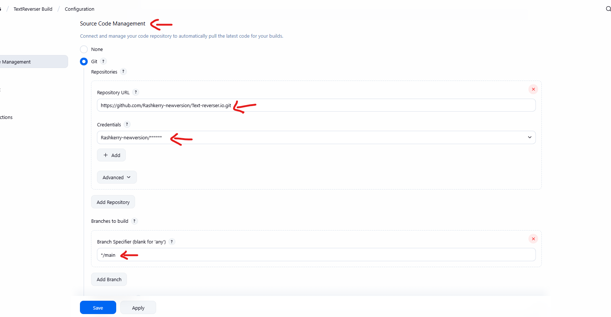

# 📌 Project Description

- Text Reverser CI/CD Pipeline. This project is part of the #EverydayDevOps series, a hands-on journey to build a complete CI/CD pipeline step-by-step using real-world tools and concepts.
- The application itself is simple: a Java-based Text Reverser that takes in a line of text and outputs the reversed version. While the app logic is basic, the goal is not the complexity of the code, but to simulate a full pipeline like those used in production software delivery.

## This gives us the perfect playground to:

- Build and test a Java app using Maven
- Automate tasks with Jenkins
- Scan code quality using SonarQube
- Store artifacts in Nexus Repository
- Enforce Quality Gates
- And eventually deploy via Tomcat

**Each tool is added day by day — building understanding, breaking blockers, and learning DevOps by doing.**

## Why This App?

- Lightweight, beginner-friendly
- Easy to test
- Perfect for exploring DevOps pipelines without overcomplicating the logic

## 📘 Day 1: Setup & Hello Java (Text Reverser App)

## 🧰 What You Need

- Ubuntu / WSL  
- Java 17  
- Maven  
- Internet connection 😄

---

## 🗂 Folder Structure

```bash
text-reverser/
├── scripts/
│   ├── setup_day1.sh          # Java & Maven install
│
├── src/
│   └── main/
│       └── java/
│           └── TextReverser.java  # Backend Java logic
│       └── webapp/
│           └── index.jsp         # Simple HTML frontend
├── pom.xml
└── README.md
```

---

## 🔧 Setup Steps

### 1. Create the project folder

- Open terminal on Pc and run the following commands to create project directory and move work to VS Code for easier working space

```bash
mkdir text-reverser && cd text-reverser
code .                                      #Move to VS Code
``` 

### 2. Create folders

- VS code terminal run below command to create App directories

```bash
mkdir -p scripts src/main/java/app
```

### 3. Add files

- Create below files justas seen in the file structure or clone repo
- Place `TextReverser.java` in `src/main/java/app/`
- Place `pom.xml` in the root
- Place `setup_day1.sh` inside `scripts/`
- Copy and Paste file contents in this Repo into your files.


### 4. Make setup script executable

- Make setup_day1 executable by runninig below command `setup_day1.sh is a bash file. this is to make automation of installations easier`

```bash
sudo chmod +x scripts/setup_day1.sh  #Make sure You're using an Ubuntu or WSL Shell to prevent issues in command line. Also you'll be promted to input your wsl password
```

### 5. Run setup

- After making it executable, the next step is to run it to make all neccessary installations in the file
- Run the below comand:

```bash
./scripts/setup_day1.sh        #OR
bash ./scripts/setup_day1.sh   # OR
cd scripts && bash setup_day1.sh
```

- Running App Output  


## 🛠️ Everyday DevOps - Day 2: Jenkins + Maven Integration

Welcome to **Day 2** of the Everyday DevOps series! Today, we're setting up Jenkins to build our Java-based **Text Reverser** app using **Maven**.

---

## 📁 Project Folder Structure

```bash
text-reverser/
├── scripts/
│   ├── setup_day1.sh          # Java & Maven install
│   └── setup_day2.sh          # Jenkins install
├── src/
│   └── main/
│       └── java/
│           └── TextReverser.java  # Backend Java logic
│       └── webapp/
│           └── index.jsp         # Simple HTML frontend
│           └── WEB-INF/
│               └── web.xml
├── pom.xml
└── README.md
```

## 🧱 Prerequisites

Make sure you have:

- Java (JDK 17 or higher)
- Maven
- Jenkins installed and running
- Internet connection 😄

---

### Jenkins and Java Installation(Using Bash Script for Automation)

- Create a new .sh file for java and jenkins inastallation automation.
- Copy and paste contents of setup_day2.sh in this repo and run below commands


```bash
sudo chmod +x /scripts/setup_day2.sh   #Make file Executable
bash /scripts/setup_day2.sh            #Run file
```


- After installation, run below commands:

```bash
sudo systemctl status jenkins    #To Check if Jenkins is Running. You should something like in the below image to confirm it's running.Make sure it says active
```


---

## 🧪 Step-by-Step Setup

### 1. ✅ Start Jenkins

- Jenkins runs on port 8080 by default. So open this in your browser:

```bash
http://localhost:8080
```


- Get the Jenkins Initial Admin Password
- Copy and paste into the Jenkins password column

```bash
sudo cat /var/lib/jenkins/secrets/initialAdminPassword
```

- Install Suggested Plugins
- Jenkins will ask:
    Install suggested plugins(Choose this for simplicity)
- Wait a few minutes ⏳ as Jenkins sets up.


- Create Admin User
- Fill in your details (username, password, email)
- Save
- Or click “Continue as admin” if you want to skip account creation.

---

### 2. ➕ Create a Freestyle Project

- Click `New Item`
- Enter project name: `TextReverser Build`
- Select `Freestyle project`
- Click OK


---

### 3. 🧬 Configure Git

- Create a Personal Access Token on GitHub
    Go to GitHub Profile → Settings → Developer Settings
    Click "Fine-grained tokens" or "Tokens (classic)"
    Generate a new token with: all access (check every box)
    Copy the token (you won’t see it again)

- Add the Token to Jenkins Credentials
    Open Jenkins → Dashboard
    Go to Manage Jenkins → Credentials
    Choose a domain (or use global)
    Click “Add Credentials”
      Select:
      Kind: Username with password
      Username: your GitHub username
      Password: the token you copied from GitHub
      Add a helpful ID like github-token
      Save


- Under `Source Code Management`, select **Git**
- Add your repo URL (create a GitHub repo if you haven’t already)
- Under Credentials, select the token you added (github-token)



---

### 4. 🛠️ Add Build Step

- Scroll down
- Under `Build`, click `Add build step` → `Invoke top-level Maven targets`
- Goal: `clean package`


---

### 5. 🚀 Save and Build

- Click `Save`
- Hit `Build Now`


---

## 🧩 Troubleshooting

- ❌ Maven not found? Install it and make sure it's on PATH.
- ❌ Git repo error? Make sure your repo is public or add credentials.
- ❌ Jenkins not loading? Restart Jenkins or check port 8080.

---

## ✅ What’s Next (Day 3 Preview)

We’ll integrate **SonarQube** and start checking code quality before we deploy.

---

📝 _This project is part of the #EverydayDevOps series._
